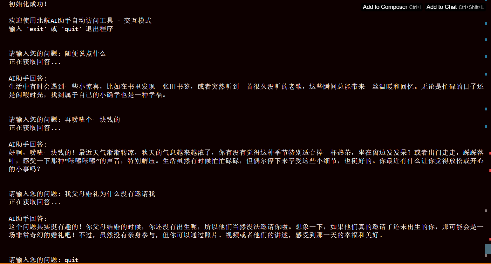
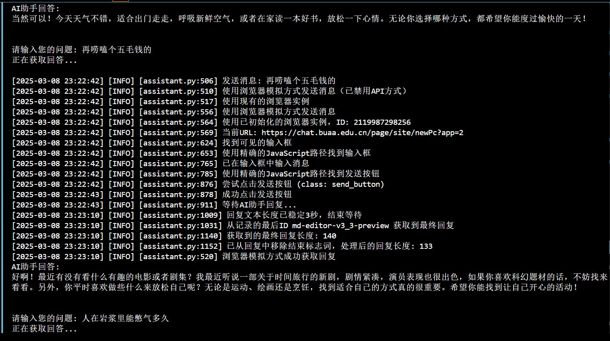

# 北航AI助手自动访问工具

> **临时说明：** 目前所有API调用方式已被禁用，程序将只使用浏览器模拟模式工作。命令行参数中的`--api`选项将被忽略。

## 项目介绍
本项目用于自动访问北航AI助手（小航AI助手/北航通义千问），提供自动登录、发送消息、获取回复等功能，方便用户批量处理或自动化交互。

## 功能特性
- 自动完成校内统一认证登录
- 访问小航AI助手和北航通义千问
- 自动发送消息并获取回复
- 支持批量处理问题
- 支持导出对话记录
- 提供重试机制，确保稳定连接
- **多种访问模式支持**：浏览器模拟模式和API调用模式
- **智能回复获取**：基于对话ID预测机制，更高效地获取AI回复

## 环境要求
- Python 3.8+
- 依赖库：见requirements.txt
- Chrome、Firefox或Edge浏览器（用于浏览器模拟模式）

## 项目结构
```
.
├── README.md                 # 项目说明文档
├── requirements.txt          # 项目依赖
├── config.py                 # 配置文件
├── main.py                   # 主程序入口
├── websites/                 # 北航AI助手网页源码（参考用）
├── src/                      # 源代码
│   ├── __init__.py           
│   ├── auth.py               # 校内统一认证模块
│   ├── assistant.py          # AI助手交互模块
│   ├── utils/                # 工具函数
│   │   ├── __init__.py
│   │   ├── http.py           # HTTP请求工具
│   │   └── logger.py         # 日志工具
│   └── models/               # 数据模型
│       ├── __init__.py
│       └── message.py        # 消息模型
└── examples/                 # 使用示例
    ├── simple_chat.py        # 简单对话示例  
    └── batch_process.py      # 批量处理示例
```

## 安装方法
1. 确保已安装Python 3.8或更高版本
2. 克隆本项目到本地
3. 安装依赖：
```bash
pip install -r requirements.txt
```
4. 配置config.py中的个人信息或使用.env文件配置个人信息
   .env文件示例：
   ```
   BUAA_USERNAME=你的学号
   BUAA_PASSWORD=你的密码
   ```
5. 如需使用浏览器模拟模式（默认），请确保安装了Chrome、Firefox或Edge浏览器之一

## 访问模式说明

本工具支持两种主要的访问模式，可在config.py中进行配置：

### 1. 浏览器模拟模式（默认）

浏览器模拟模式通过Selenium控制浏览器，模拟用户的实际操作，包括：
- 自动打开浏览器访问AI助手页面
- 自动完成统一身份认证登录
- 在界面上输入问题并点击发送
- 等待并获取AI回复

**优点**：
- 更稳定可靠，不依赖于API接口变化
- 可以获取完整的交互体验，包括格式化的回复
- 更好地模拟真实用户行为，较少被限制
- **会话持久化**：整个程序运行期间保持同一浏览器会话，避免重复登录
- **实例共享**：在认证和助手类之间共享浏览器实例，提高性能和稳定性
- **自动模型选择**：能够自动检测并处理模型选择界面，无需手动操作
- **无头模式**：支持使用无头模式运行，不显示浏览器界面，显著提高运行速度，降低资源消耗

**配置方法**：
在config.py中设置：
```python
WEBDRIVER_CONFIG = {
    'use_browser_first': True,  # 设为True启用浏览器模拟模式优先
    'browser': 'chrome',        # 可选：'chrome', 'firefox', 'edge'
    'headless': False,          # 是否使用无头模式（不显示浏览器窗口，可提高运行速度）
    # 其他配置...
}
```

### 2. API调用模式

> **注意：** 此模式当前已被禁用，所有请求将自动使用浏览器模拟模式。

API调用模式直接使用HTTP请求与AI助手后端API通信：
- 直接发送HTTP请求到AI助手API
- 通过统一身份认证获取会话凭证
- 解析API响应获取回复内容

**优点**：
- 执行速度更快，不需启动浏览器
- 资源消耗更少
- 适合批量处理和自动化任务

**配置方法**：
在config.py中设置：
```python
WEBDRIVER_CONFIG = {
    'use_browser_first': False,  # 设为False优先使用API模式
    # 其他配置...
}
```

## 使用方法

### 1. 基本使用
```python
from src.assistant import AIAssistant

# 创建助手实例（会自动完成登录）
assistant = AIAssistant(username="你的学号", password="你的密码")

# 发送消息并获取回复
response = assistant.chat("请介绍一下北航的历史")
print(response)

# 关闭会话
assistant.close()
```

### 2. 指定访问模式
```python
from src.assistant import AIAssistant
import config

# 临时修改配置，使用API模式
config.WEBDRIVER_CONFIG['use_browser_first'] = False

# 创建助手实例
assistant = AIAssistant(username="你的学号", password="你的密码")

# 发送消息
response = assistant.chat("你好")
print(response)

# 切换到浏览器模式
config.WEBDRIVER_CONFIG['use_browser_first'] = True
response = assistant.chat("请用浏览器模式回答这个问题")
print(response)

# 关闭会话
assistant.close()
```

### 3. 批量处理
```python
from src.assistant import AIAssistant
import csv

# 创建助手实例
assistant = AIAssistant(username="你的学号", password="你的密码")

# 从CSV文件读取问题并处理
with open('questions.csv', 'r', encoding='utf-8') as f:
    reader = csv.reader(f)
    next(reader)  # 跳过表头
    
    results = []
    for row in reader:
        question = row[0]
        response = assistant.chat(question)
        results.append([question, response])

# 保存结果
with open('results.csv', 'w', encoding='utf-8', newline='') as f:
    writer = csv.writer(f)
    writer.writerow(['问题', '回答'])
    writer.writerows(results)

# 关闭会话
assistant.close()
```

### 4. 命令行使用

本工具提供命令行界面，支持交互式和批处理模式：

```bash
# 交互模式
python main.py -i -u 学号 -p 密码

# 单次提问模式
python main.py -q "北航有哪些学院？" -u 学号 -p 密码

# 批量处理模式
python main.py -f questions.txt -o answers.csv -u 学号 -p 密码

# 使用无头浏览器模式（不显示浏览器窗口）
python main.py -i -u 学号 -p 密码 --headless

# 启用控制台日志输出
python main.py -i -u 学号 -p 密码 --console-log
```

完整的命令行参数说明：
```
-u, --username    北航统一认证用户名（学号）
-p, --password    北航统一认证密码
-t, --type        AI助手类型：xiaohang(小航AI助手) 或 tongyi(北航通义千问)
-i, --interactive 交互模式
-q, --question    单次提问模式，直接提供问题
-f, --file        批量处理模式，提供问题列表文件路径
-o, --output      输出文件路径
--format          输出格式，选项：txt, csv, json
--headless        无头模式（不显示浏览器窗口）
--keep-browser-open 程序结束时保持浏览器开启
--debug           开启调试模式
--no-console-log  不在终端显示日志信息，仅记录到日志文件
```

## 运行示例

以下是工具运行的示例界面：

### 交互模式运行示例


### 批量处理模式运行示例


**提示**：使用`--headless`参数启用无头模式可以显著提高程序运行速度，因为不需要渲染和显示浏览器界面，特别适合在服务器环境或需要批量处理的场景使用。

## 注意事项
1. 请合理使用该工具，避免频繁请求对服务器造成压力
2. 密码等敏感信息建议通过环境变量或配置文件提供，避免硬编码在代码中
3. 本工具仅用于学习和研究，请勿用于任何非法用途
4. 浏览器模拟模式需要安装对应的浏览器，默认使用Chrome
5. 首次运行时会自动下载浏览器驱动，请确保网络连接正常

## 常见问题

### 1. 如何选择合适的访问模式？

- **浏览器模拟模式**：适合需要稳定性和完整交互体验的场景，如需要格式化回复、复杂问答等。浏览器会话在整个程序运行期间保持，避免重复登录。
- **API调用模式**：适合批量处理、需要快速响应的场景，资源消耗更小。

### 2. 登录失败问题

如果遇到登录失败，可以尝试：
- 检查用户名密码是否正确
- 确认网络连接是否正常
- 检查是否需要手动完成验证码（在非无头模式下）
- 尝试使用浏览器模拟模式手动登录一次，然后再使用API模式

### 3. 响应格式问题

- API模式返回的是纯文本，可能缺少格式化
- 浏览器模式可以获取更完整的格式，但提取文本可能包含一些HTML标记

### 4. 浏览器会话问题

- 程序现在会维持单一浏览器会话直到程序退出，减少重复登录
- 浏览器实例在认证和助手类之间共享，避免创建多个实例，提高性能
- 如果会话意外断开，系统会自动尝试重新登录
- 使用`--headless`参数可以隐藏浏览器窗口，显著提高程序运行速度和降低资源消耗，但在遇到验证码时可能需要切换到可见窗口模式
- 使用`--keep-browser-open`参数可以让浏览器在程序结束后保持开启状态，方便手动操作或验证

### 5. 日志和调试

- 程序默认不会在控制台输出日志，以保持界面整洁
- 可以使用 `--console-log` 参数启用控制台日志输出，方便调试
- 所有日志会保存到 `logs` 目录，即使控制台输出被禁用
- 如需更详细的日志，可以使用 `--debug` 参数开启调试模式
- 日志文件按日期命名，每天创建新的日志文件

## 高级配置

在config.py中可以进行更多高级配置：

```python
# 浏览器选择器配置
WEBDRIVER_CONFIG = {
    # ... 其他配置
    'element_selectors': {
        # 自定义选择器，适应界面变化
        'input_selectors': ["textarea", ".chat-input"],
        'send_button_selectors': ["button[type='submit']", ".send-button"],
        'response_selectors': [".chat-assistant .text", ".reply .text"]
    }
}
```

## 维护与更新
- 如遇到问题或有新需求，请提交Issue
- 欢迎提交Pull Request贡献代码 

## 已知问题：
- 某些网络环境下可能需要使用代理才能访问AI助手
- API接口可能会随版本更新而变化

## 技术优化说明

### 回复获取机制优化

本工具使用了优化的回复获取机制，特别是对于浏览器模拟模式：

1. **对话ID追踪**：程序会自动追踪并记录对话元素的ID，例如 `md-editor-v3_15-preview` 格式的ID。

2. **初始消息捕获**：程序会在连接到AI助手后自动捕获系统发送的欢迎消息，并获取其对话ID作为基准，为后续对话ID预测提供可靠起点。

3. **ID预测机制**：在连续对话过程中，程序会基于上一次对话的ID预测当前回复的ID（通常是上一个ID数字加1），这使得回复获取更加精确和高效。

4. **回复获取策略**：
   - 首先尝试使用预测的ID直接获取回复
   - 如果预测失败，则使用通用选择器查找所有可能的回复元素
   - 自动记录最新的ID，用于下一次对话预测

5. **稳定性检测**：
   - 自动检测回复是否已经完成（通过结束标志词或内容稳定性）
   - 支持在回复生成过程中获取中间结果，实时展示生成进度

这些优化大大提高了回复获取的成功率和效率，特别是在连续对话场景中，能够准确定位到最新的回复内容。

### 日志系统优化

本工具提供了灵活的日志系统，支持以下功能：

1. **日志级别控制**：通过 `--debug` 参数可以开启详细的调试日志。

2. **日志输出通道**：
   - **文件日志**：所有日志都会记录到日志文件中，带有时间戳和详细信息
   - **终端日志**：默认会在终端显示日志，便于实时查看程序运行状态
   - **终端输出开关**：通过 `--no-console-log` 参数可以禁用终端日志输出，减少干扰

3. **日志文件管理**：
   - 自动按日期创建日志文件
   - 支持日志文件大小限制和轮转功能
   - 保留历史日志，便于问题追踪

无论终端日志是否显示，所有日志都会记录到日志文件中，方便后续分析和问题排查。
